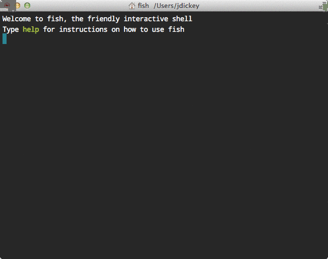

Local GitHub Navigator
======================

g allows you to very quickly navigate between GitHub project cloned on your
local box. It will `cd` into project directories quickly and clone repos that do
not exist.

Here is a demo of me moving around various projects:



Usage
=====

Go to `~/src/github.com/dickeyxxx`:

```
g
```

Go to `~/src/github.com/dickeyxxx/myrepo`:

```
g myrepo
```

Go to `~/src/github.com/otheruser/repo`:

```
g otheruser repo
```

If it does not already exist it will be cloned.

Note that tab completion is available for project names.

Dependencies
============

* [Fish shell](http://fishshell.com/) ([interested in a bash/zsh version?](https://github.com/dickeyxxx/g/issues))
* [hub](https://hub.github.com/)

Installation
============

Add this environment variable for your GitHub username:

    set -U GITHUB dickeyxxx

Then symlink (or copy) the function into `$fish_function_path`:

    ln -s ~/src/github.com/dickeyxxx/g/g.fish ~/.config/fish/functions/g.fish

Go developers
=============

This follows the standard convention for Go projects so long as you have your
`GOHOME` set to `~`.
